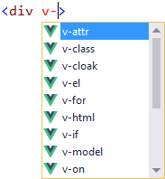
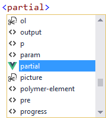
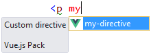
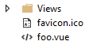
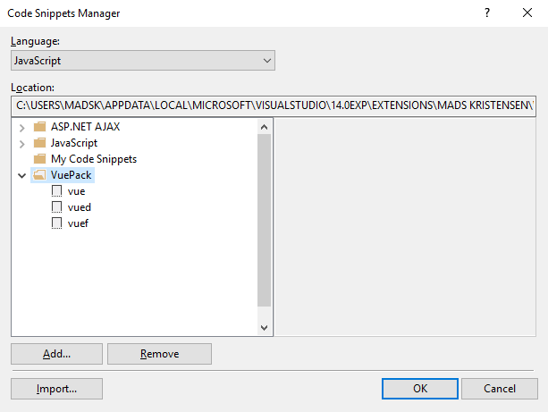

# Vue.js Pack

[](https://ci.appveyor.com/project/madskristensen/vuepack)

Download this extension from the [VS Gallery](https://visualstudiogallery.msdn.microsoft.com/30fd019a-7b90-4f75-bb54-b8f49f18fbe1)
or get the [CI build](http://vsixgallery.com/extension/6ac8e91a-ade2-4e25-a8e1-a779dd6aeca3/).

---------------------------------------

Contains HTML Intellisense and code snippets for the
[Vue.js](http://vuejs.org)
JavaScript library

See the [changelog](CHANGELOG.md) for changes and roadmap.

## Features

- **.vue** files are mapped to open in the HTML editor
- HTML Intellisense for built-in directives
- HTML Intellisense for custom directives and components
- File icon for **.vue** files
- JavaScript snippets

### Directives Intellisense
Built in directives are shown in Intellisense to make it easier
to write an to avoid typos.

Any directive or component defined in any .vue or .js file in
the project will be show up in Intellisense.

#### Built in directives


#### Special elements


#### Custom components/elementDirectives


#### Custom directives


### File icon
Solution Explorer correctly displays a file icon for .vue
files.



### JavaScript snippets
A few handy snippets are available to speed up boilerplating
of vew models, filters and directives.

#### vue (view model)

```javascript
var vm = new Vue({

    el: "#app"

})
```

#### vued (directive)

```javascript
Vue.directive('my-directive', {

    bind: function () {
        // content
    },

    update: function (value) {
        // content
    },

    unbind: function () {
        // content
    }
})
```

#### vuef (filter)

```javascript
Vue.filter('my-filter', function (value) {

    $end$

})
```

Here's what it looks like in the Code Snippets Manager.



## Contribute
Check out the [contribution guidelines](CONTRIBUTING.md)
if you want to contribute to this project.

For cloning and building this project yourself, make sure
to install the
[Extensibility Tools 2015](https://visualstudiogallery.msdn.microsoft.com/ab39a092-1343-46e2-b0f1-6a3f91155aa6)
extension for Visual Studio which enables some features
used by this project.

## License
[Apache 2.0](LICENSE)